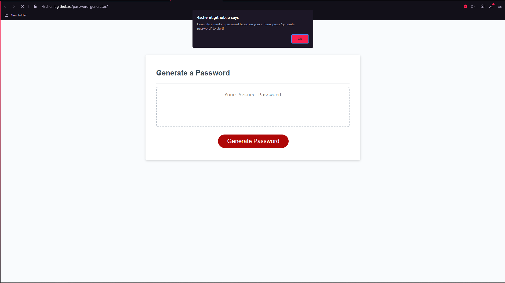

# Password Generator

## Description

A random password generator that creates a password based on user input that is 8-128 characters long.

## Getting Started

### Dependencies

* None

### Installing

* Install gitbash
* Copy code https
* Use "git clone (code) (./folderyoucreate)"

### Executing program

* Right click on index.html and select open with (preferred browser)

### Usage

Click on generate password and follow the prompts to generate a random password

## Authors

Contributors names and contact info:

4scheriit  
mbrownet@gmail.com

## License

This project is licensed under the MIT License - see the LICENSE.md file for details
